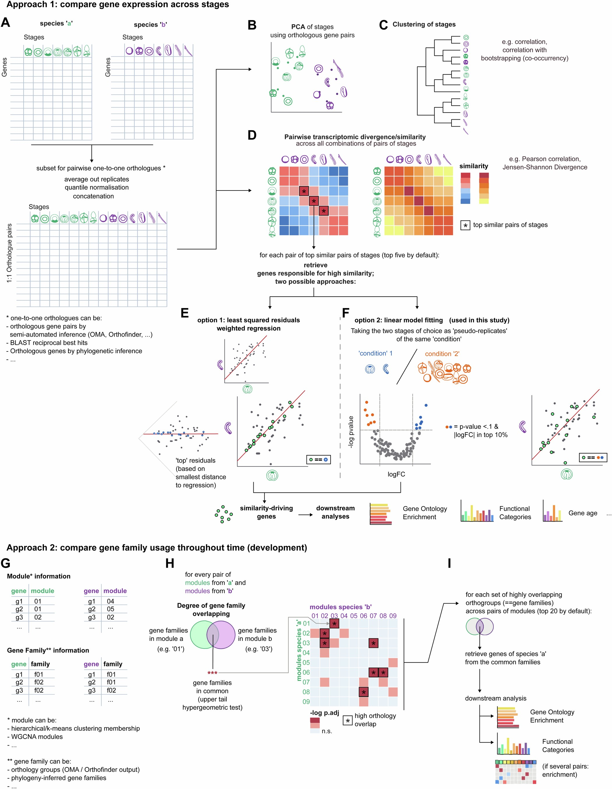

# comparABle🦄🔁🐉

`comparABle` (stylised as compar**ab**le) is a small collection of functions in R to **analyse and compare gene expression data across pairs of species**.

# Quick overview

Consider two species "***A***" and "***B***", each with a gene expression dataset (for ***A***: `a` ; for ***B*** : `b`) consisting of genes in rows and samples in columns.

To compare these datasets, you can equate them by using orthologous genes. These can be retrieved from multiple sources (e.g. BLAST reciprocal best hits, semi- or fully automated methods of orthology inference such as Orthofinder or Broccoli, or gene phylogenies). For a given gene from ***A*** we find its orthologous gene in ***B***; this, for many genes (ideally all of them). We call this an 1-to-1 orthologue association file, or `o`.

Using `o`, `a`, and `b`, we can now work with the same gene features for the different samples from each species, which allows us to do similarity-based approaches like correlation. Comparing these samples between species ***A*** and ***B*** can highlight the most similar ones. Further analyses can help us identify "the reason why" they are so similar; that is, what genes are overall most expressed, and in an similar manner, between these samples relative to others.

In addition, if we have a priori knowledge of the programmes/modules to which these genes belong in each species, we can perform additional analyses to compare the degree of overlap between these.

# Requirements

* `a`: a dataset of genes x condition for species A
* `b`: a dataset of genes x condition for species B
* `o`: a 1-to-1 orthologue association file between genes of species A and B (e.g. blast reciprocal hits, oma 1:1 orthologues, ...)
* `f`: a gene family file associating genes from species A and B (e.g. Orthofinder output
* (optional, reccommended) `ma, mb`: gene classification system. For each species a and b, a file associating genes to gene 
moules (e.g. k-means clusters, hierarchical clusters, WGCNA modules, etc.)
* (optional, reccommended) `g`: a gene age file for the gene families, and the genes, of each species

Briefly, comparABle generates correlation matrices across conditions of species, retrieves the most similar
conditions based on bootstrapped survival clustering, and compares gene modules through orthology overlap strategy:

 1. Normalise the expression datasets
 2. Associate the datasets using the association file of 1-to-1 orthologues
 3. Perform a principal component analysis with the merge of the two datasets
 4. Perform pairwise correlations and distance metrics between conditions (in our case, developmental stages) of datasets to see their relationships of similarity. By default: Pearson Correlation, Spearman Correlation, and Jensen-Shannon Divergence. 
 5. Identify the genes responsible for the pairwise-similarities observed in step4 across conditions (in our case, stages), and perform Gene Age and Gene Ontology enrichment analysis
 6. Perform a co-occurrence analysis in the merge of the two datasets (pairwise correlations, hierarchical clustering, and bootstrapping with downsampling) (Current implementation as seen in [Levy et al., 2021](https://github.com/sebepedroslab/Stylophora_single_cell_atlas/blob/857eb758bb6886bd91482cfe601e9bd5f56b12de/metacell_downstream_functions/Tree_functions.R)  )
 7. Perform Orthology Overlap analysis (hypergeometric and binomial) in pairwise correlations between gene sets (==stage-specific clusters) of each species.
 8. Identify the genes of the gene families that appear significantly enriched across pairs of gene sets, and perform Gene Age, Gene Ontology, and Functional Category enrichment analyses.

Optional analyses include downstream GO, COG functional category, and Gene Age enrichment of common genes across datasets, or common gene families across modules of the species.

comparABle can be passed the **same species in a and b** to generate an **intra-specific comparison** of conditions, and gene modules. Potentially useful when denovo-exploring novel cell types or structures at the molecular level.

## Graphical overview

Taken from [the original publication](https://www.nature.com/articles/s41559-024-02562-x), see also the [accompanying repository](https://github.com/apposada/ptychodera_cisreg_development):

We followed two general approaches to assess gene expression similarity between pairs of species:
  * Approach 1 (A-E) comprises comparing transcriptional dynamics across pairs of stages. Approach 2 (G-I) comprises comparing gene family usage throughout time in development.
  * For Approach 1, we (A) retrieved all **pairwise one-to-one orthologous** gene expression data of a pair of species. The two expression matrices, with the same number of rows and arranged in the same order, were **normalised** and **concatenated**. From this matrix, we performed (B) principal component analysis (**PCA**) and (C) **clustering** of the different stages. D: we retrieved the **top similar pairs of stages** using several metrics. For each pair of similar pairs of stages, or for a given pair of stages of interest, we retrieved the **genes responsible for driving these high similarities**.
    * One way is by performing weighted linear regression and retrieval of least-squared distance residuals (E);
    * In this study (F) we took the two pairs of stages of choice as **pseudo-replicates in a non-bespoke linear modelling** (two-sided) analysis against the rest of stages of both species. Genes detected as “specifically expressed” in the pair of stages (p-value < 0.1 and logFC in top 10% values) were considered as driving similarities, and used for downstream analysis.
  * Approach 2: we used **orthogroups as proxy for gene families** and tested the degree of **overlapping gene families between pairs of temporal clusters of genes** (G). H: for every pair of modules from each species, we measured the overlap in gene families and tested it against a hypergeometric distribution (one-tailed **hypergeometric test**). The top pairs of modules enriched in overlapping gene families were used for downstream analysis (I). See Methods of original publication for more details.

## More

See [the Future plans document](docs/futureplans.md) for more information.

See the [the original publication](https://www.nature.com/articles/s41559-024-02562-x) for more details on the rationale.

See also the [accompanying repository](https://github.com/apposada/ptychodera_cisreg_development) for more detailed step-by-step application of the code.